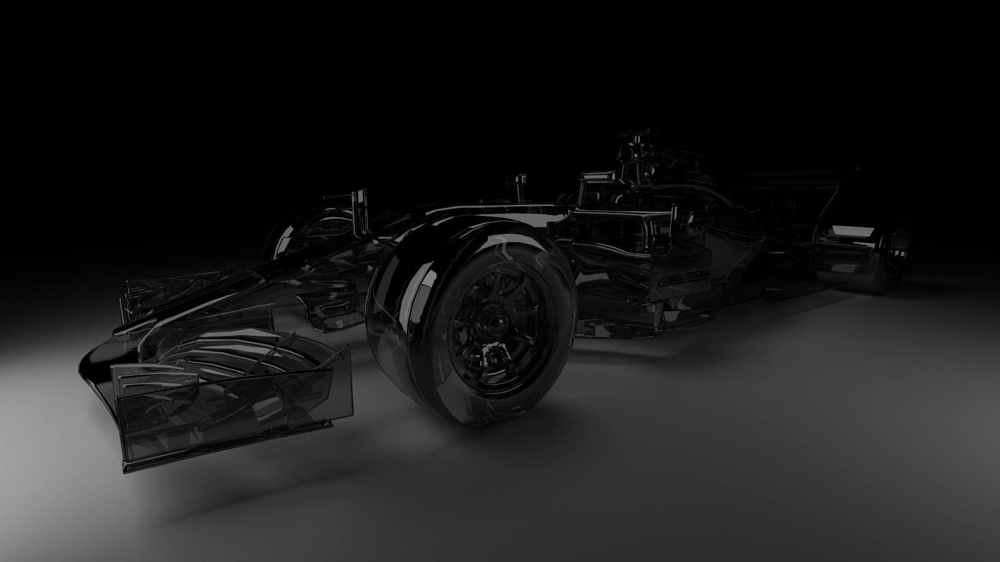

# Ray Tracer

## Introduction

This repository contains a path trace renderer implemented with c++/cuda.

### Easy configuration of scene

The render can load multiple wavefront obj models and set each model's transform and material details respectively, which is easliy achieved through editing scene configuration file. Other render configurations like viewport size, FOV, sample per pixel (spp), camera position and direction can all be setup easily by scene config file. See files under `assets/scene/`.

### Fast rendering

With the help of Nvidia CUDA compute library, two images above (formula 1 with texture and space shuttle, size 2000x1200, 8192 spp, max ray depth 8) cost only ~70 seconds to render on a RTX 4090 gpu. (Surely the time is dependent on the complexity of the scene.)

## Setup

This project is developed and tested on linux systems, but with proper include file and library setup it may also work on other platforms supporting CUDA.

### Requirements

- CUDA Runtime and CUDA compile toolkit.
- OpenCV for image reading and writing.

### Build

Run `make -j -B`.

### Run

Please download the corresponding obj model from the url in scene configuration file.

Run `bin/main <path/to/scenefile> <path/to/output/dir> <batch_size>`. 

### Hints

The batch size is used to control the number of interations in each kernel launch, but note that **the rays are randomly sampled before each iteration**. Hence, the less the batch size, the more iterations there are and the rays would be more evenly distributed, but the render overhead would be higher.

> ❗️ The material type in the render is different from most wavefront obj files downloaded from internet, which is mostly defined as metal (illum = 2). So you may adjust the `.mtl` file to assign the correct material type.

| **mtl illum** | **Material Type**      | **Description**          |
|---------------|------------------------|--------------------------|
| 1             | `Material::LAMBERTIAN` | Diffuse (Lambertian)     |
| 2             | `Material::METAL`      | Metal surface            |
| 3             | `Material::LIGHT`      | Light-emitting material  |
| 4             | `Material::REFRACTIVE` | Custom type: glass       |
| 5             | `Material::REFLECTIVE` | Custom type: mirror      |
| Default       | `Material::LAMBERTIAN` | Fallback to diffuse      |